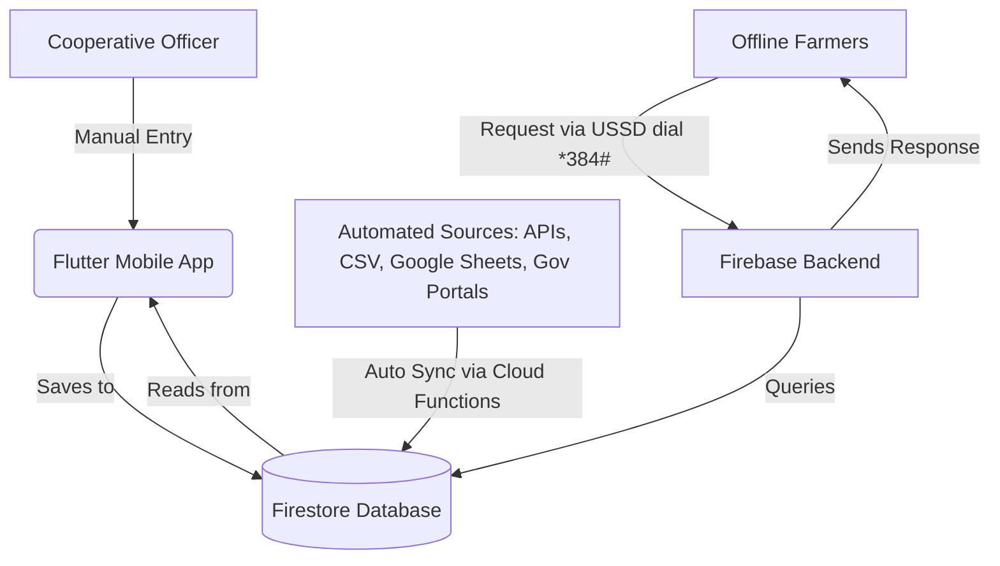

# Beginner's Guide: Agricultural Data Integration Systems

Welcome! If you are a complete beginner, this guide is designed for you. It explains how agricultural market systems gather, store, and share crop prices using both manual entries (like your Cooperative Dashboard) and automated integration.

---

## 1. What is an Agricultural Data Integration System?

Imagine an agricultural market system is a **community bulletin board** for crop prices. 

* **Manual Entry**: A cooperative officer walks into the local market, writes down the price of maize, and pins it to the board. 
* **Data Integration**: An automated messenger that automatically checks the government registry, fetches prices from other districts, downloads spreadsheets, and pins them to the board for you.

An **Agricultural Data Integration System** connects different software systems together so that crop prices from multiple sources flow automatically into your database without human effort.

---

## 2. Your System Architecture Overview

Your system is built with four major parts that work together:



### How the components connect:
1. **Flutter Mobile App**: The user interface. Cooperative officers use it to **manually enter** prices (e.g., Crop Name, Price, Market, District).
2. **Firestore Database**: The central storage room (NoSQL Database). It keeps track of all current and historical crop prices.
3. **Firebase Backend (Node.js)**: The brain of the system. It handles incoming requests, validates data, and runs automation.
4. **USSD Integration**: A text-based menu (e.g., dialing `*384#` on a basic flip-phone) that allows offline farmers with no internet to query the Firestore database and get real-time price SMS updates.
5. **Automated Price Updates**: Automated programs that run in the backend to pull price data from external websites and update the Firestore database.

---

## 3. Explaining the Integration Concepts

Here is a simple breakdown of the six core integration concepts:

### ① REST APIs
* **What it is in simple terms**: A REST API is like a waiter in a restaurant. You (the client) look at the menu and ask the waiter for a dish (a request). The waiter goes to the kitchen (the server/database) and brings you the food (the response).
* **How it works here**: Your Flutter app talks to your Firebase backend using a REST API. Similarly, your backend can call external REST APIs (e.g., a currency exchange rate API or a regional market API) to fetch prices automatically.
* **Simple Example**:
  ```javascript
  // Fetching maize price from a regional market REST API in Node.js
  const response = await fetch('https://api.regionalmarket.com/prices/today?crop=maize');
  const data = await response.json(); 
  console.log(data.price); // Output: 450 (MK per kg)
  ```

### ② CSV Data Feeds
* **What it is in simple terms**: CSV stands for "Comma-Separated Values." It is a text file that looks like a simplified spreadsheet. Each row is a line, and each column is separated by a comma.
* **How it works here**: Many agricultural organizations publish weekly reports as CSV files. Your system can download these files and "parse" (read) them line-by-line to extract the prices.
* **Simple Example**:
  ```csv
  cropName,price,unit,market,district
  Maize,400,kg,Central Market,Lilongwe
  Beans,1200,kg,Limbe Market,Blantyre
  ```
  *Your code reads this text file, splits it by commas, and saves each row to Firestore.*

### ③ Google Sheets Integration
* **What it is in simple terms**: Sometimes, cooperative leads or farm extension officers prefer to type prices into a shared Google Sheet instead of using a mobile app. 
* **How it works here**: Google provides a free API for Google Sheets. Your Firebase backend can read this shared sheet every hour, find new entries, and upload them to Firestore.
* **Simple Example**:
  1. The officer types `Maize | 420 MK` in cell `A2` and `B2` of a Google Sheet.
  2. The Firebase backend requests sheet data: `sheets.spreadsheets.values.get({ spreadsheetId, range: 'Sheet1!A2:B2' })`.
  3. The backend receives `['Maize', '420']` and updates Firestore.

### ④ Government Agriculture Portals
* **What it is in simple terms**: Governments often maintain websites showing national crop prices. However, they rarely have easy APIs.
* **How it works here**: We write a script to import their published tables. If they offer an export button, we pull the export automatically. If they don't, we can use "web scraping" (a program that reads the HTML code of the website and extracts the numbers).
* **Simple Example**:
  *The portal website has `<td>Maize</td><td>MK 450/kg</td>`. The script finds the `<td>` tags, extracts `Maize` and `450`, and stores it.*

### ⑤ Scheduled Data Synchronization
* **What it is in simple terms**: Checking for updates at set intervals instead of waiting for a human to trigger it.
* **How it works here**: You don't want your database to be out-of-date, but you also don't want to waste computer power checking every second. Scheduled synchronization is like checking your physical mailbox once a day at 9:00 AM.
* **Simple Example**:
  *Every night at 12:00 AM, the system starts a sync job. It downloads the latest government CSV, checks Google Sheets, calls regional REST APIs, updates Firestore, and marks the sync as complete.*

### ⑥ Cloud Functions Cron Jobs
* **What it is in simple terms**: A "cron job" is an automated alarm clock for code. Firebase Cloud Functions are pieces of code that run in the cloud. A Cloud Functions Cron Job tells Firebase: "Run this specific function every morning at 6:00 AM."
* **How it works here**: We schedule a Cloud Function using a simple schedule rule (like `every 24 hours` or `0 6 * * *`). When the clock strikes, the function wakes up, executes the automated synchronization, and goes back to sleep.
* **Simple Example**:
  ```javascript
  // A Firebase Cloud Function cron job that runs every day at 6:00 AM
  exports.dailyPriceSync = functions.pubsub.schedule('0 6 * * *')
    .timeZone('Africa/Blantyre')
    .onRun(async (context) => {
      console.log("Wake up! Starting automated price synchronization...");
      await fetchLatestPricesFromAllSources();
      return null;
    });
  ```

---

## 4. How They Connect Together in Your Market System

In your real-world system, **Manual Entries** and **Automated Syncs** live happily side-by-side:

```
                  ┌─────────────────────────────────────┐
                  │      COOPERATIVE OFFICERS           │
                  │ (Manually type prices into Flutter) │
                  └──────────────────┬──────────────────┘
                                     │ (Instant POST Request)
                                     ▼
                  ┌─────────────────────────────────────┐
                  │       FIRESTORE DATABASE            │
                  │   - Store manual & automated data   │
                  │   - Standardize under status field  │
                  └──────────────────▲──────────────────┘
                                     │ (Cron Sync Job)
                                     │
    ┌────────────────────────────────┴────────────────────────────────┐
    │                    AUTOMATED SYNC ENGINE                        │
    │  (Cloud Function Cron Job runs daily, fetches from REST APIs,   │
    │   Google Sheets, CSV feeds, & Gov Portals, then updates DB)     │
    └─────────────────────────────────────────────────────────────────┘
                                     │
              ┌──────────────────────┴──────────────────────┐
              ▼                                             ▼
  ┌───────────────────────┐                     ┌───────────────────────┐
  │     ONLINE USERS      │                     │    OFFLINE FARMERS    │
  │ (Flutter App reads DB)│                     │ (Query prices via USSD│
  └───────────────────────┘                     │  which triggers backend)
                                                └───────────────────────┘
```

### The Step-by-Step Flow:
1. **The Core Database (Firestore)** receives prices from two doors:
   * **Door 1 (Manual)**: Cooperative Officers submit local market prices via the **Flutter app**. These are marked as `submittedBy: "User_ID"` and can go through an approval process.
   * **Door 2 (Automated)**: A **Cloud Function Cron Job** runs every morning. It fetches external prices from **REST APIs**, downloads **CSVs** from **Government Portals**, and reads updates from shared **Google Sheets**. It formats them and writes them directly to Firestore (marked as `submittedBy: "system_automation"`).
2. **Unified Data**: Firestore consolidates both manual and automated prices.
3. **Sharing the Data**:
   * **Smartphone users** open the **Flutter app**, which fetches the combined list of prices in real-time.
   * **Feature-phone users (offline farmers)** dial a **USSD code** on their phones. The USSD service sends a request to the Firebase backend, which instantly queries Firestore and replies with the latest price as a text menu on their screen.

This hybrid approach ensures that even if local officers are busy and don't enter prices manually, the system stays up-to-date with automated government and portal feeds!
