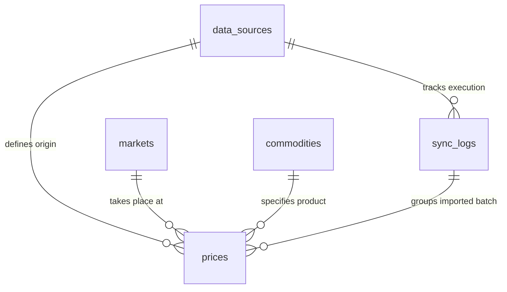

# Firestore Database Design for Automated Agricultural Data Ingestion

This guide describes a Firestore database schema designed to handle both **manual entries** (from cooperative officers) and **automated data ingestion** (such as REST APIs, CSV feeds, Google Sheets, and World Bank API data).

---

## 1. Collection Architecture & Relationships

Firestore is a **NoSQL Document Database**. Instead of tables and rows, it uses **Collections** (folders) and **Documents** (files with key-value data).

Here is how our five collections relate to each other:



### Why Each Collection Exists:

1. **`commodities`**: The master list of standardized agricultural products (e.g., Maize, Soybeans, Cassava). Standardizing names prevents having duplicate entries like "Maize", "maize", and "Corn".
2. **`markets`**: The physical locations or virtual platforms where trade happens (e.g., Lilongwe Central Market, World Bank Global Index).
3. **`data_sources`**: Configures and documents where automated data comes from (e.g., Google Sheet link, Government API endpoint, World Bank API parameters).
4. **`prices`**: The core data table storing individual price records. Each document points back to a commodity, a market, and the source that provided it.
5. **`sync_logs`**: The audit trail of every automated import job. It records whether a sync succeeded, how many records were imported, and error messages if it failed.

---

## 2. Full Firestore Schema & Field Descriptions

### ① Collection: `commodities`
*Standardizes crop definitions.*
* **`id`**: Document ID (e.g. `maize` or auto-generated `commodity_001`)
* **`name`**: String (Common name, e.g., "Maize")
* **`category`**: String (Category group, e.g., "Grains", "Legumes", "Tubers")
* **`standardUnit`**: String (Default unit, e.g., "kg", "metric_ton")
* **`createdAt`**: Timestamp

### ② Collection: `markets`
*Standardizes market locations.*
* **`id`**: Document ID (e.g. `lilongwe_central` or auto-generated `market_001`)
* **`name`**: String (Market name, e.g., "Lilongwe Central Market")
* **`type`**: String (Type of market, e.g., "local", "wholesale", "national", "global_index")
* **`district`**: String (e.g., "Lilongwe")
* **`country`**: String (e.g., "Malawi")
* **`location`**: Geopoint (Optional geographical coordinates for maps)
* **`createdAt`**: Timestamp

### ③ Collection: `data_sources`
*Defines configuration for automated parsers.*
* **`id`**: Document ID (e.g. `world_bank_api`, `gov_portal_csv`)
* **`name`**: String (Friendly name, e.g., "World Bank Maize Pink Sheet")
* **`type`**: String (e.g., `"api"`, `"csv"`, `"google_sheets"`)
* **`endpointUrl`**: String (URL to download data or spreadsheet ID)
* **`frequency`**: String (Sync schedule, e.g., `"daily"`, `"weekly"`)
* **`isActive`**: Boolean (Toggles sync jobs on/off)
* **`lastSyncedAt`**: Timestamp

### ④ Collection: `prices`
*Stores actual price observations.*
* **`id`**: Document ID (Auto-generated UUID)
* **`commodityId`**: Reference/String (Links to a document in `/commodities`)
* **`marketId`**: Reference/String (Links to a document in `/markets`)
* **`price`**: Number (Standardized numerical value)
* **`currency`**: String (e.g., `"MWK"`, `"USD"`)
* **`unit`**: String (The unit this price represents, e.g., `"50kg_bag"`, `"kg"`)
* **`sourceType`**: String (How the data was captured: `"manual"`, `"automated"`)
* **`dataSourceId`**: String (Links to `/data_sources` if automated, or user ID if manual)
* **`syncLogId`**: String (Links to `/sync_logs` indicating which import run wrote this price)
* **`validationStatus`**: String (Verification status: `"pending"`, `"approved"`, `"rejected"`)
* **`priceDate`**: Timestamp (The actual calendar day this price was active)
* **`createdAt`**: Timestamp (When this document was written to database)

### ⑤ Collection: `sync_logs`
*Logs import runs for debugging and audit.*
* **`id`**: Document ID (Auto-generated UUID)
* **`dataSourceId`**: Reference/String (Links to `/data_sources`)
* **`status`**: String (`"success"`, `"failed"`, `"partial_success"`)
* **`startedAt`**: Timestamp
* **`completedAt`**: Timestamp
* **`recordsImported`**: Number (Count of prices saved)
* **`errorMessage`**: String (If failed, details of the error)

---

## 3. Example Documents (JSON Format)

Below are realistic examples of documents inside each collection:

### Commodity Document (`/commodities/maize`)
```json
{
  "name": "White Maize",
  "category": "Grains",
  "standardUnit": "kg",
  "createdAt": "2026-05-27T12:00:00Z"
}
```

### Market Document (`/markets/lilongwe_central`)
```json
{
  "name": "Lilongwe Central Market",
  "type": "local",
  "district": "Lilongwe",
  "country": "Malawi",
  "location": {
    "latitude": -13.9626,
    "longitude": 33.7741
  },
  "createdAt": "2026-05-27T12:00:00Z"
}
```

### Data Source Document (`/data_sources/world_bank_pink_sheet`)
```json
{
  "name": "World Bank Global Pink Sheet Prices",
  "type": "api",
  "endpointUrl": "http://api.worldbank.org/v2/sources/2/country/WLD/series/GFDD.OI.19",
  "frequency": "weekly",
  "isActive": true,
  "lastSyncedAt": "2026-05-27T06:00:00Z"
}
```

### Price Document (Automated Import Example) (`/prices/price_abc123`)
```json
{
  "commodityId": "maize",
  "marketId": "lilongwe_central",
  "price": 450,
  "currency": "MWK",
  "unit": "kg",
  "sourceType": "automated",
  "dataSourceId": "world_bank_pink_sheet",
  "syncLogId": "log_xyz789",
  "validationStatus": "approved",
  "priceDate": "2026-05-27T00:00:00Z",
  "createdAt": "2026-05-27T06:01:15Z"
}
```

### Sync Log Document (`/sync_logs/log_xyz789`)
```json
{
  "dataSourceId": "world_bank_pink_sheet",
  "status": "success",
  "startedAt": "2026-05-27T06:00:00Z",
  "completedAt": "2026-05-27T06:01:20Z",
  "recordsImported": 42,
  "errorMessage": null
}
```

---

## 4. Beginner Explanation of the Design Decisions

* **Referencing IDs instead of nesting data**: In the `/prices` documents, instead of writing out the full details of the market (name, district, location) every single time, we save space and remain clean by just storing `"marketId": "lilongwe_central"`. If a market changes its name from "Central Market" to "Grand Market", we only have to edit it once in the `/markets` collection, and all price references update automatically!
* **Why have a `validationStatus`?**: Automated imports can sometimes contain bugs or extreme spikes (e.g. typing an extra zero). By having a status (`pending`, `approved`, `rejected`), we can automatically mark CSV and Google Sheet imports as `pending` so a coordinator can review them in the admin dashboard before they are broadcasted to offline farmers via USSD.
* **Why split `priceDate` and `createdAt`?**: `createdAt` is when the computer ran the sync script. `priceDate` is when the crop was actually that price in the physical market. They are often different (for example, importing last week's historical government portal spreadsheet).
